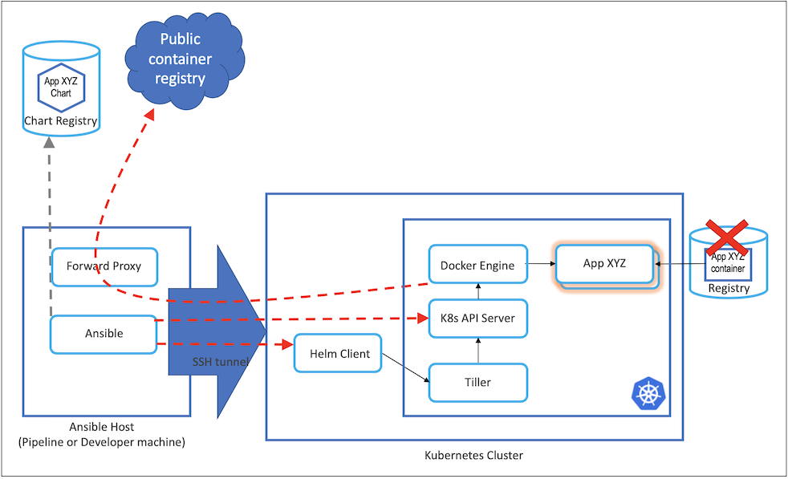

## Ansible Playbooks to install an air gapped Highly Available Kubernetes cluster
Uses Kubeadm with the --experimental-control-plane switch to install the Stacked Control Plane. This deployment pattern is well suited to single purpose, secure, infrastructure software clusters with low frequency container changes.

- Uses recently GA'd Kubeadm 1.13 HA multi-master joining features
- Uses the Ansible Host as a short lived forward proxy to download cluster software and container images
- No container registry is required (downloaded images are cache to the local docker engines)


### Prerequisites:

* Setup ssh access from Ansible host to Kubernetes nodes.
```ssh-copy-id -i ~/.ssh/id_rsa.pub <user@host>```
- Setup a local forward proxy with Internet access on the Ansible host (e.g. tinyproxy). Update the proxy environment variable details in `inventory/group_vars/all`.




### Environment preparation:

Specify the Master and Worker hostnames in the `inventory/cluster` file:

Update the `inventory/group_vars` sections:
- choose the desired versions for kubernetes and docker
- setup the pod network cidr (default setup is for calico - modify in calico.yaml as well)
- specify the version of Helm to use
- specify the Local Storage Provisioner version


### Install process:

Run install-all.yaml playbook to get your cluster fully setup. Note port 8888 below is the default for tinyproxy- adjust according to your proxy install.
You can also run the different playbooks separately for different purposes (setting up docker, masters, kubeadm, helm ...).

```
ansible-playbook -i inventory/cluster playbooks/install-all.yaml --private-key=~/.ssh/id_rsa -u username --extra-vars ansible_ssh_extra_args="-R8888:localhost:8888" -v
```

### What install-all.yaml includes:

- Adds the required yum repositories
- Installs docker
- Installs kubeadm, kubelet and kubectl
- Initializes the first master with etcd and kubernetes-api
- Installs Calico networking
- Joins replica master nodes to the primary master
- Adds the worker nodes to the cluster
- Installs Helm & Tiller
- Install Kubernetes Dashboard (Metrics Server support coming 02/19)
- Installs Local Storage Provisioner (usefull for cloud native, shared nothing, stateful set apps such as Kafka, Zookeeper, Elastic)

### Still to do:
- Update Replica Master /etc/kubernetes/* file permissions after Ansible copy